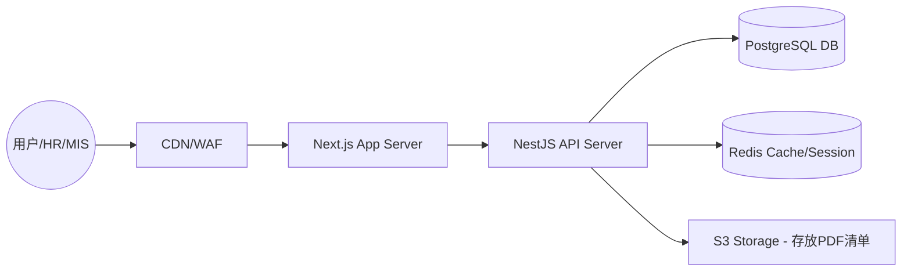

> 🏗️ **技术总监** | 步骤 2/4 | 67.0s

---

你好，我是软件架构师。我已经仔细阅读了 Alex 提供的业务分析。

Alex 成功地将一个简单的“表单需求”提升到了**“资源生命周期管理”**的高度。他识别出的**状态机（State Machine）**、**资产绑定逻辑**以及**离职镜像思维**，为架构设计提供了关键的约束条件。

这个系统的核心挑战不在于高并发，而在于**数据的强一致性（资产不能被重复指派）**、**流程的严谨性（状态流转）**以及**快速交付的开发效率**。

以下是我为该系统制定的技术选型方案。

---

# 🛠️ 新人资源准备系统：技术选型方案

## 1. 总体架构选型：模块化单体 (Modular Monolith)

**决策：** 采用单一代码库，但内部通过逻辑模块（HR 模块、MIS 模块、资产模块）进行解耦，部署为单个服务。

**理由：**
- **复杂度匹配**：系统目前的规模不需要微服务，微服务会引入不必要的分布式事务问题（例如：在更新资产状态和更新请求单状态时，需要强一致性）。
- **开发效率**：小团队可以快速迭代，无需处理跨服务调用和复杂的 API 网关。
- **可演进性**：如果未来资产管理模块需要扩展成企业级的资产管理系统（EAM），由于采用了模块化设计，可以很容易地将其抽离为独立服务。

---

## 2. 技术栈选型矩阵

| 维度 | 选型 | 理由 | 对业务支撑 |
| :--- | :--- | :--- | :--- |
| **前端框架** | **Next.js (React) + Tailwind CSS + Shadcn UI** | 现代化的全栈框架，拥有极佳的组件库。 | **快速开发**：Shadcn UI 提供了专业且一致的管理后台界面，无需从零写 CSS。 |
| **后端语言** | **Node.js (TypeScript) + NestJS** | 强类型支持，企业级架构模式（依赖注入、模块化）。 | **逻辑严谨**：TypeScript 确保了资源状态（Draft $\rightarrow$ Pending...）在代码层面的类型安全。 |
| **数据库** | **PostgreSQL** | 强大的关系型数据库，支持 ACID 事务。 | **数据一致性**：确保资产编号唯一，防止同一台笔记本被指派给两个新人。 |
| **ORM** | **Prisma** | 现代化的 Type-safe ORM，可视化 Schema 管理。 | **开发效率**：极大地加快了数据库迁移（Migration）和关联查询的编写速度。 |
| **部署方案** | **Docker + 简单 VPS / 云容器 (如 AWS ECS/Aliyun ACK)** | 容器化部署，环境一致性。 | **可维护性**：一次构建，到处运行，方便后续进行 CI/CD 自动化部署。 |

---

## 3. 数据库设计 (Core Schema)

基于 Alex 提出的“资产关联关系”，我设计了以下核心表结构。这里采用关系型数据库以支撑复杂的 Join 查询。

### 核心实体关系图 (ERD 逻辑)
- `Request` (1) $\rightarrow$ (N) `ResourceAssignment` (中间表)
- `Asset` (1) $\rightarrow$ (N) `ResourceAssignment`
- `Account` (1) $\rightarrow$ (N) `ResourceAssignment`

### 关键表结构定义

#### 1. `Requests` (入职请求表)
- `id`: UUID (PK)
- `employee_name`: String
- `department`: String
- `job_role`: String
- `status`: Enum (`DRAFT`, `PENDING`, `PROCESSING`, `READY`, `DELIVERED`, `CANCELLED`)
- `request_date`: DateTime
- `created_by`: UserID (FK)

#### 2. `Assets` (硬件资产库)
- `id`: UUID (PK)
- `asset_tag`: String (Unique, 财产编号)
- `category`: Enum (`LAPTOP`, `MONITOR`, `PHONE`, etc.)
- `model`: String
- `status`: Enum (`IN_STOCK`, `IN_USE`, `MAINTENANCE`, `SCRAPPED`)
- `current_user_id`: UserID (Nullable, FK)

#### 3. `Accounts` (软件账号库)
- `id`: UUID (PK)
- `service_name`: String (e.g., "Email", "Slack", "GitHub")
- `account_id`: String (Unique, 登录账号)
- `initial_password`: EncryptedString (存储加密后的初始密码)
- `status`: Enum (`AVAILABLE`, `ASSIGNED`)

#### 4. `ResourceAssignments` (资源指派关联表)
- `id`: UUID (PK)
- `request_id`: UUID (FK)
- `asset_id`: UUID (Nullable, FK)
- `account_id`: UUID (Nullable, FK)
- `assigned_at`: DateTime
- `assigned_by`: UserID (FK)

---

## 4. 关键技术挑战与应对方案 (ADR 预演)

### Q1: 如何保证资产指派时不冲突？
**方案：数据库事务 + 状态锁。**
在 MIS 执行绑定操作时，开启一个数据库事务：
1. `SELECT ... FROM Assets WHERE id = X AND status = 'IN_STOCK' FOR UPDATE` (行级锁)
2. 如果记录存在 $\rightarrow$ 更新 `status = 'IN_USE'` $\rightarrow$ 插入 `ResourceAssignments` 记录。
3. 提交事务。
**效果：** 彻底杜绝并发场景下同一资产被重复指派。

### Q2: 敏感账号密码如何安全传递？
**方案：临时凭据 + 访问审计。**
- 数据库中存储加密密码。
- 当 HR 生成《资源清单》时，系统生成一个带有过期时间的 **Signed URL** (例如 24 小时有效)。
- 新人点击链接后，系统记录一次 `Access Log`，并在查看后标记该密码为“已激活/需更改”。

### Q3: 如何支撑 Alex 提到的“资源模板化”？
**方案：配置表 `ResourceTemplates`。**
建立一个模板表，定义 `Role` $\leftrightarrow$ `RequiredResources` 的映射。
- 当 HR 选择“研发岗” $\rightarrow$ 后端查询模板 $\rightarrow$ 在 `ResourceAssignments` 中预创建若干条 `status = 'UNASSIGNED'` 的记录 $\rightarrow$ MIS 看到的界面就是一张“待勾选清单”。

---

## 5. 部署架构图 (Conceptual)

## 🚀 架构总结

本方案放弃了过度设计的微服务，选择了 **Next.js + NestJS + PostgreSQL** 的黄金组合。
- **对 HR**：通过 Next.js 的流畅界面快速提交请求。
- **对 MIS**：通过 PostgreSQL 的强一致性确保资产登记不出错。
- **对公司**：通过模块化单体设计，保证了目前开发速度最快，且未来具备向离职回收系统演进的灵活性。